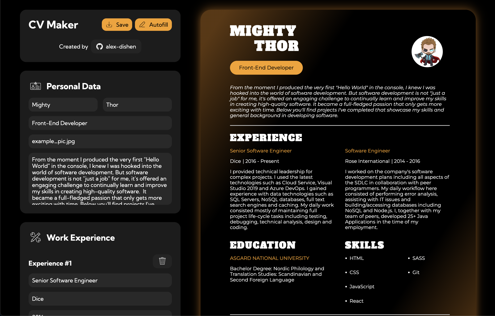

# CV Maker
The **CV Maker** project is created according to the assignment from **The Odin Project** [course](https://www.theodinproject.com/paths/full-stack-javascript/courses/javascript).
<br>
<br>



### 🔗 **Live preview** of the project is [here](https://alex-dishen.github.io/cv-maker/).

## **Features**
* Customizable PDF download.
* Picture upload.

## **Outcome**
* Used **React**.
* Used **SCSS**.
* Learned SCSS mixins, inheritance, nesting.
* Learned React classes components, states and props.
* Learned React way of managing inputs.
* Learned how to create PDF from class component.
* Learned how to upload and then show a picture in React.

## **Getting Started**
```
HTTPS - git clone https://github.com/alex-dishen/cv-maker.git

SSH - git clone git@github.com:alex-dishen/cv-maker.git

cd cv-maker

npm install

npm start
```

## **Navigation**
* See my next project [Memory Card](https://github.com/alex-dishen/memory-card)
* See my previous project [Library](https://github.com/alex-dishen/tic-tac-toe)